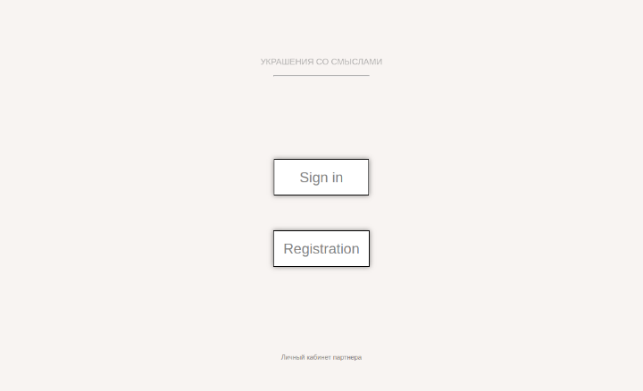
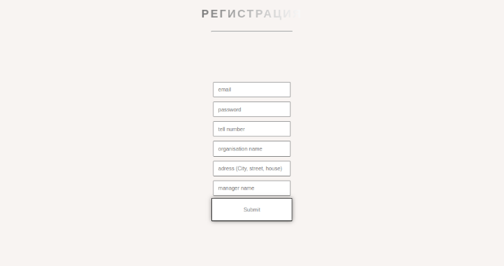
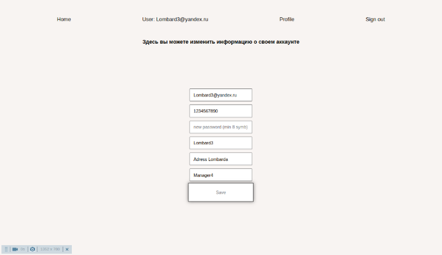
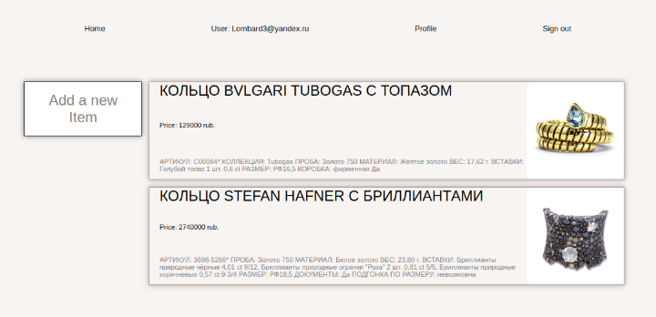
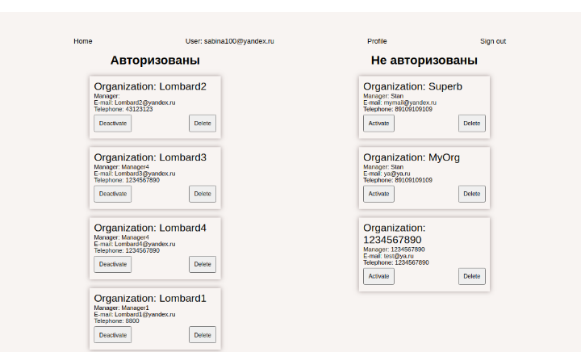

# Агрегатор "JewellryBase"
## Приложение "JewellryBase" - это - платформа для обмена актуальной информацией между ломбардами и интернет-магазином.
## Стэк - HBS, Express js, MongoDB Atlas, HTML, CSS.
### Команда разработчиков:
- [Александр П.](https://github.com/PapakhinAV)
- [Станислав Г.](https://github.com/stangrishin)
- [Виктор Р.](https://github.com/Vict0rFrosta)

### Приложение позволяет:
- ломбардам поддерживать актуальную информацию об имеющихся товарах в своих профилях, а администратор интернет-магазина может при поступлении заказов оперативно уточнять наличие и бронировать украшения в ломбарде.

## Для запуска проекта
- Склонировать проект
- Инициализировать проект в корневой папке - npm i
- В корневой папке создать файл .env (Смотреть внизу README)
- Запустить проект из корневой папки - npm start
- Для запуска приложения используется база MongoDB в Atlas
- Приложение запустится после билда (дождаться окончания) по адресу localhost:3000
#
## Возможности приложения
### `Регистрация юзера`
Каждый юзер может зарегистрироваться указав свои данные.

#
### `Редактирование профиля юзера`
- Изменение e-mail и пароля
- Редактрирование контактных данных

#
### `Добавление/удаление товаров на странице юзера`
Каждый юзер (после подтверждения прав администратором) может добавлять на своей страницы свои товары.

#
### `Администратор`
Администратор может удалять юзеров, авторизовывать или блокировать пользователей.

